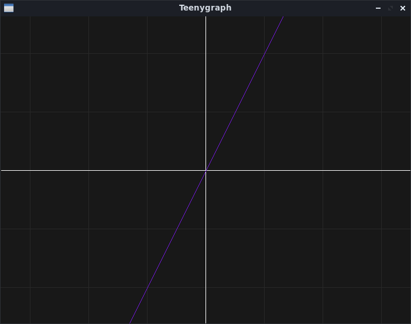

# Teenygraph
A teeny tiny code that plot Python functions.


## Pre-requisites
The required Python libraries are listed below:

- Json
- Graphics.py
- Getch

Those can be installed with PIP. For example:
```
python3 -m pip install graphics.py getch
```

## Initializing
Import _tg.py_. For the _sin()_ function, _math_ library is also required.

```
vp1147@debian-ideapad:~/Documentos/GitHub/teenygraph$ python3
Python 3.7.3 (default, Dec 20 2019, 18:57:59) 
[GCC 8.3.0] on linux
Type "help", "copyright", "credits" or "license" for more information.
>>> import tg
>>> import math
```

Select a predefined theme (_dark.json_ or _paper.json_). For instance:

```
tg.theme("dark.json")
```

Call the **init** function
```
>>> tg.init(800,10,1)
```

An empty graph will be created with the following properties:  
**Window size:** 	**800**x768  
**X axis size:** 	**10** (-5 to 5)
**Grid interval:** 	**1** 

Define a function that receives a value (_x_) and returns another (_math.sin(x)_):  
```
>>> def Sin(x):
...     return math.sin(x)
...
>>>
```
So, the graph will read:  
**x:** x
**y/f(x):** math.sin(x)  

Then, just plot the defined function:
```
>>> tg.plot(Sin)
```


More examples are avaliable on _examples.py_.
