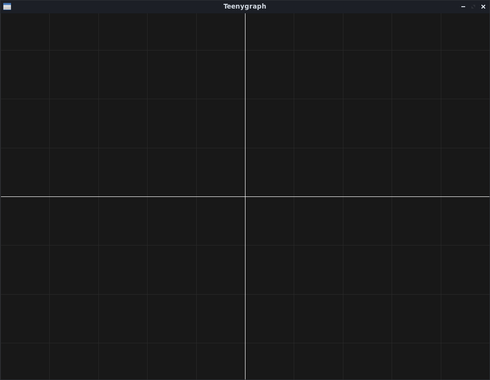
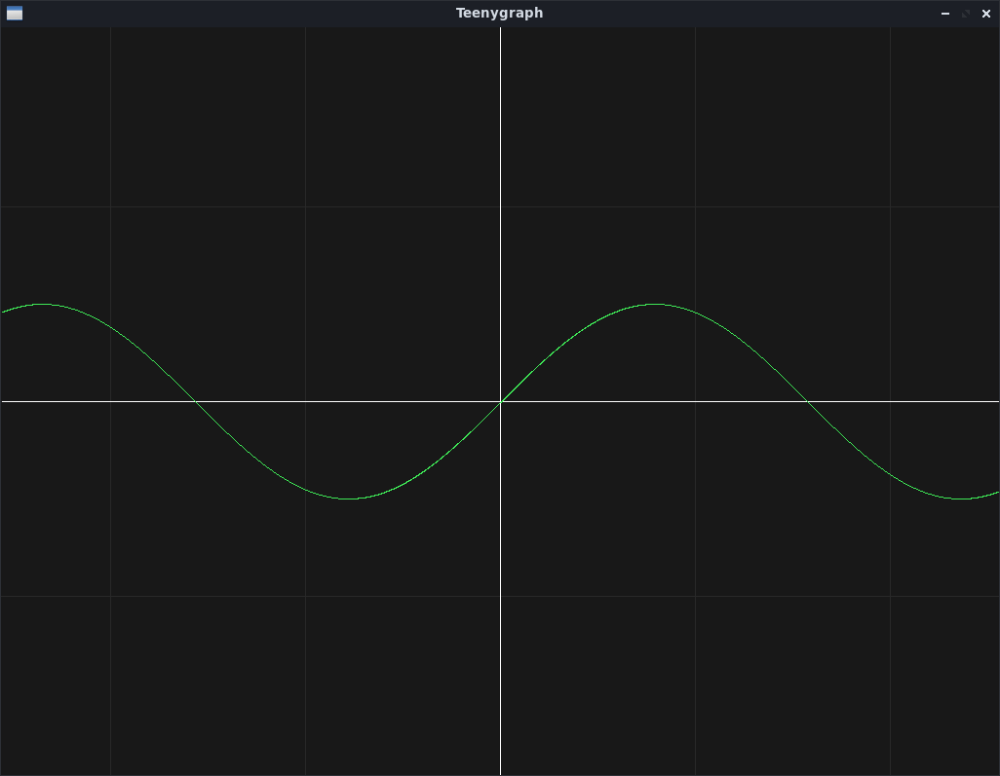

# Teenygraph
A teeny tiny Python tool for graphical function plot.


## Requirements
The required Python libraries are listed below:
- Tkinter
- Graphics.py
- Getch

Those can be installed with:
```
python3 -m pip install graphics.py getch
sudo apt install python3-tk
```

## Initializing
Import _tg.py_. For the _sin()_ function, _math_ library is also required.

```
>>> import tg
>>> import math
```

Select a predefined theme (_dark.json_ or _paper.json_). For instance:

```
>>> tg.theme("dark.json")
```

Call the **init** function
```
>>> tg.init(800,10,1)
```

An empty graph will be created with the following properties:  
**Window size:** 	**800**x768  
**X axis size:** 	**10** (-5 to 5)
**Grid interval:** 	**1** 

Define a function that receives a value (_x_) and returns another (_math.sin(x)_):  
```
>>> def Sin(x):
...     return math.sin(x)
...
>>>
```
So, the graph will read:  
**x:** x

**y/f(x):** math.sin(x)  

Plot the defined function:
```
>>> tg.plot(Sin)
```


More examples are avaliable on _examples.py_.

## Customizing

### Color Themes
New JSON color themes can be created acording to the model below:
```
{
  "Color1": [r,g,b],
  "Color2": [r,g,b],
  "Color3": [r,g,b],
  "Color4": [r,g,b],
  "Color5": [r,g,b]
}
```
- R, G and B correspond to RGB values (0-255).
- **"Color1"**: Background color;
- **"Color2"**: (x,y) axis color;
- **"Color3"**: Grid color;
- **"Color4"**: Function color;
- **"Color5"**: Markers color.
